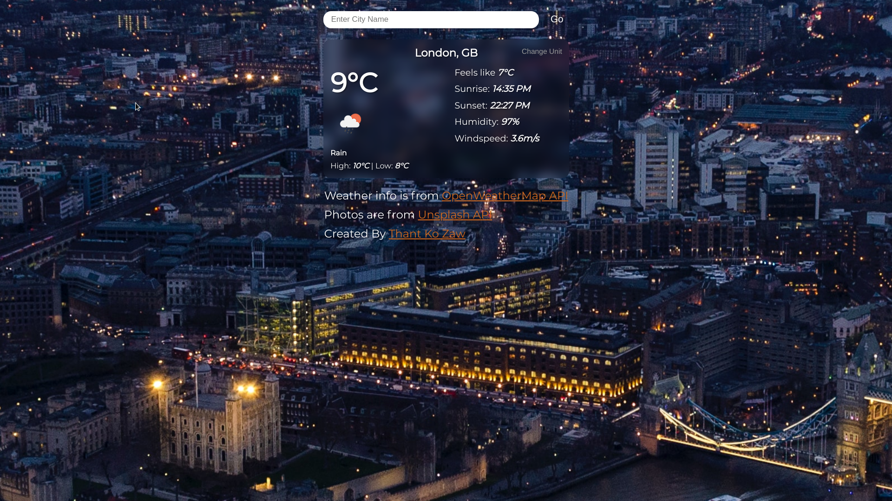

# Weather App

Weather App made with vanilla Javascript using [OpenWeatherMap API](https://openweathermap.org/api).

## Live Link

Live preview on [github pages](https://thantko20.github.io/weather-app/).

## Demo Photos

## My Experience

Project is made as part of learning AJAX. I also use [Unsplash API](https://unsplash.com/developers) for changing background images of given city. I kinda struggled with styling rather than implementing core functionalities of the app. But I'm happy anyways and as soon as I've learnt react, I will implement it with react for painless experience and more features

There's only one feature in this app. Show current weather info of the given city. I'll probably add 8-day forecast later.

## Acknowledgement

Special thanks to [The Odin Project](https://www.theodinproject.com/).